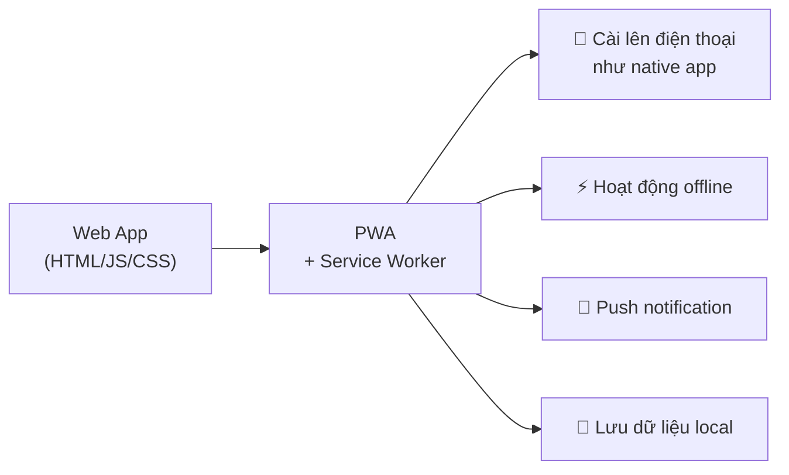
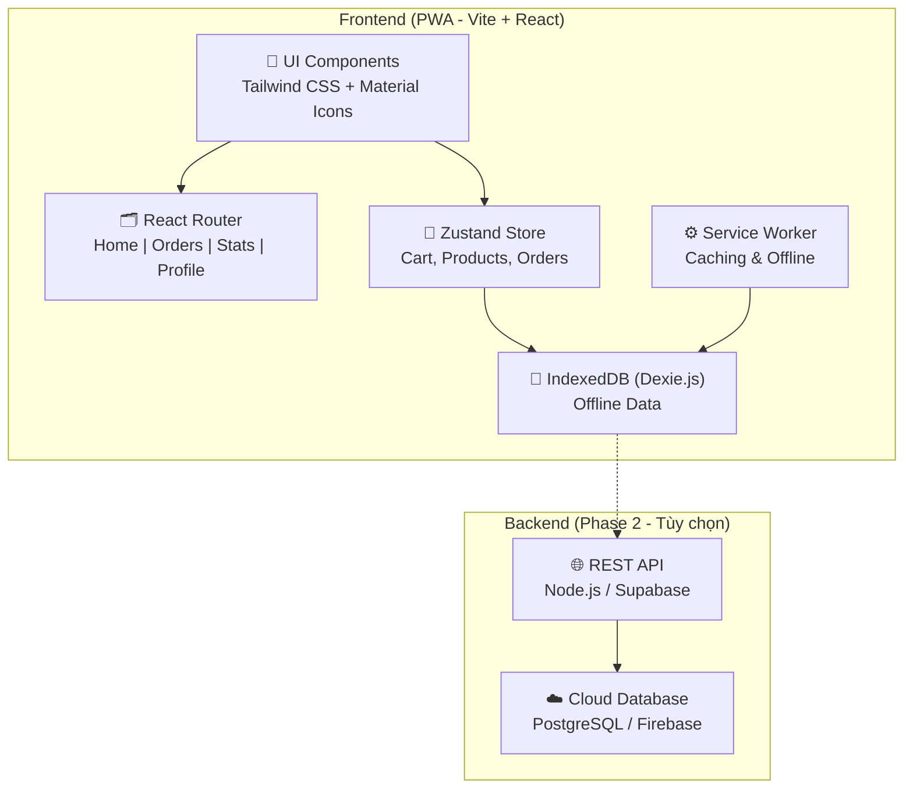

# Web App Bán Hàng Mang Đi — Phân Tích & Đề Xuất

## 1. Phân Tích Giao Diện Hiện Có

Dựa trên 3 file HTML trong thư mục `html/`, giao diện đã được thiết kế theo phong cách **Mobile-First POS** (Point of Sale) với theme cafe "Cozy Sips":

````carousel

<!-- slide -->

<!-- slide -->

````

### Các trang hiện có:

| Trang | File | Chức năng |
|-------|------|-----------|
| **Trang chủ** | [index.html](file:///d:/wordpress-themes/app-cafe/html/index.html) | Hiển thị doanh thu hôm nay, danh sách sản phẩm dạng grid 2 cột, bộ lọc danh mục (Tất cả, Cà phê, Trà & Trái Cây, Bánh Ngọt), nút "Bán ngay" |
| **Checkout** | [check-out.html](file:///d:/wordpress-themes/app-cafe/html/check-out.html) | Chi tiết sản phẩm, chọn đóng gói (Ly/Chai), chọn số lượng (+/-), ghi chú, tổng thanh toán, nút "Xác nhận bán" |
| **Thống kê** | [thong-ke.html](file:///d:/wordpress-themes/app-cafe/html/thong-ke.html) | Dashboard doanh thu, số đơn hàng, biểu đồ cột (sản phẩm bán ra trong tuần), biểu đồ tròn (bán chạy nhất) |

### Đặc điểm thiết kế:
- **Material Design 3** color system (primary, secondary, tertiary, surface variants...)
- Font **Montserrat**, icon **Material Symbols Outlined**
- **Mobile-first** với bottom navigation bar (Home, Rewards, Orders, Profile)
- Glassmorphism, soft shadows, rounded corners, micro-animations
- Tailwind CSS CDN

---

## 2. Chức Năng Chính Đề Xuất

### 🏠 Module 1: Bán hàng (POS - Point of Sale)
- Hiển thị danh sách sản phẩm theo danh mục
- Tìm kiếm nhanh sản phẩm
- Nút "Bán ngay" → chọn đóng gói, số lượng, ghi chú
- Giỏ hàng (shopping bag) — thêm nhiều sản phẩm vào 1 đơn
- Xác nhận bán & in/chia sẻ hóa đơn

### 📋 Module 2: Quản lý đơn hàng (Orders)
- Danh sách đơn hàng theo thời gian (hôm nay, tuần, tháng)
- Trạng thái đơn: Đang chờ → Hoàn thành → Đã hủy
- Chi tiết từng đơn hàng
- Tìm kiếm / lọc đơn hàng

### 📊 Module 3: Thống kê & Báo cáo (Dashboard)
- Doanh thu hôm nay / tuần / tháng
- Số lượng đơn hàng
- Biểu đồ doanh thu theo ngày (bar chart)
- Top sản phẩm bán chạy (doughnut chart)
- So sánh % tăng/giảm so với kỳ trước

### 📦 Module 4: Quản lý sản phẩm
- CRUD sản phẩm (thêm, sửa, xóa, ẩn/hiện)
- Phân loại danh mục
- Đặt giá, ảnh sản phẩm
- Quản lý tùy chọn đóng gói (Ly, Chai, v.v.)

### 👤 Module 5: Hồ sơ & Cài đặt
- Thông tin cửa hàng
- Quản lý tài khoản nhân viên (nếu cần)
- Cài đặt đơn vị tiền tệ, ngôn ngữ
- Xuất dữ liệu (Excel/PDF)

---

## 3. Đề Xuất Công Nghệ

> [!IMPORTANT]
> Yêu cầu chính: **Chạy tốt trên điện thoại**, dùng cho nhân viên bán hàng mang đi, cần nhanh, offline-ready.

### Phương án đề xuất:

| Thành phần | Công nghệ | Lý do |
|------------|-----------|-------|
| **Frontend Framework** | **Next.js (React)** hoặc **Vite + React** | SPA nhanh, hỗ trợ PWA, component-based, dễ mở rộng |
| **Styling** | **Tailwind CSS v3** | Giữ nguyên design system hiện có, utility-first, responsive sẵn |
| **Icons** | Material Symbols Outlined | Giữ nguyên từ thiết kế |
| **Font** | Montserrat (Google Fonts) | Giữ nguyên từ thiết kế |
| **Biểu đồ** | Chart.js | Nhẹ, đã dùng trong thiết kế hiện tại |
| **State Management** | Zustand hoặc React Context | Nhẹ, quản lý giỏ hàng & đơn hàng |
| **Lưu trữ dữ liệu** | **IndexedDB** (via Dexie.js) hoặc **localStorage** | Offline-first, không cần server ban đầu |
| **PWA** | Workbox + Service Worker | Cài đặt như app trên điện thoại, hoạt động offline |
| **Backend (tùy chọn mở rộng)** | Supabase / Firebase hoặc Node.js API | Đồng bộ dữ liệu giữa các thiết bị, backup cloud |

### Tại sao chọn PWA (Progressive Web App)?



- **Không cần tải từ App Store/Google Play** — mở link → cài ngay
- **Chạy mượt trên mọi điện thoại** (Android & iOS)
- **Hoạt động khi mất mạng** — critical cho quán bán hàng
- **Chi phí phát triển thấp** — 1 codebase cho web + mobile
- **Cập nhật tức thì** — không cần submit app store

---

## 4. Kiến Trúc Ứng Dụng Đề Xuất



---

## 5. Cấu Trúc Thư Mục Dự Kiến

```
app-cafe/
├── public/
│   ├── manifest.json          /** PWA manifest */
│   ├── sw.js                  /** Service Worker */
│   └── icons/                 /** App icons cho PWA */
├── src/
│   ├── components/
│   │   ├── layout/
│   │   │   ├── ZTTeamHeader.jsx
│   │   │   ├── ZTTeamBottomNav.jsx
│   │   │   └── ZTTeamLayout.jsx
│   │   ├── product/
│   │   │   ├── ZTTeamProductCard.jsx
│   │   │   ├── ZTTeamProductGrid.jsx
│   │   │   └── ZTTeamCategoryFilter.jsx
│   │   ├── checkout/
│   │   │   ├── ZTTeamCheckoutForm.jsx
│   │   │   ├── ZTTeamQuantitySelector.jsx
│   │   │   └── ZTTeamPackagingPicker.jsx
│   │   ├── order/
│   │   │   ├── ZTTeamOrderList.jsx
│   │   │   └── ZTTeamOrderDetail.jsx
│   │   └── dashboard/
│   │       ├── ZTTeamRevenueCard.jsx
│   │       ├── ZTTeamWeeklyChart.jsx
│   │       └── ZTTeamTopProducts.jsx
│   ├── pages/
│   │   ├── ZTTeamHomePage.jsx
│   │   ├── ZTTeamCheckoutPage.jsx
│   │   ├── ZTTeamOrdersPage.jsx
│   │   ├── ZTTeamStatsPage.jsx
│   │   └── ZTTeamProfilePage.jsx
│   ├── stores/
│   │   ├── ztteam_cartStore.js
│   │   ├── ztteam_productStore.js
│   │   └── ztteam_orderStore.js
│   ├── db/
│   │   └── ztteam_database.js     /** Dexie.js IndexedDB */
│   ├── App.jsx
│   ├── main.jsx
│   └── index.css                  /** Tailwind base */
├── tailwind.config.js             /** Design tokens từ HTML */
├── package.json
└── vite.config.js
```

---

## Open Questions

> [!IMPORTANT]
> **Câu hỏi 1**: Bạn muốn app hoạt động hoàn toàn **offline** (không cần server, lưu dữ liệu trên thiết bị) hay cần **đồng bộ lên cloud** (nhiều thiết bị dùng chung, backup dữ liệu)?

> [!IMPORTANT]
> **Câu hỏi 2**: App dành cho **1 người bán duy nhất** (chủ quán tự bán) hay cần hỗ trợ **nhiều nhân viên** với phân quyền?

> [!IMPORTANT]
> **Câu hỏi 3**: Có cần tính năng **in hóa đơn / chia sẻ bill** (qua Bluetooth printer hoặc screenshot) không?

> [!IMPORTANT]
> **Câu hỏi 4**: Bạn muốn dùng **Vite + React** (nhẹ, nhanh, SPA thuần) hay **Next.js** (có SSR, SEO tốt hơn nhưng nặng hơn)?

---

## Verification Plan

### Manual Verification
- Kiểm tra responsive trên Chrome DevTools (iPhone SE, iPhone 12, Samsung Galaxy)
- Test cài PWA trên điện thoại Android/iOS thực tế
- Test offline mode (tắt mạng → vẫn bán hàng được)
- Test hiệu năng với Lighthouse (target: Performance > 90, PWA > 90)
